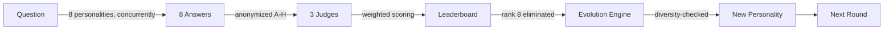
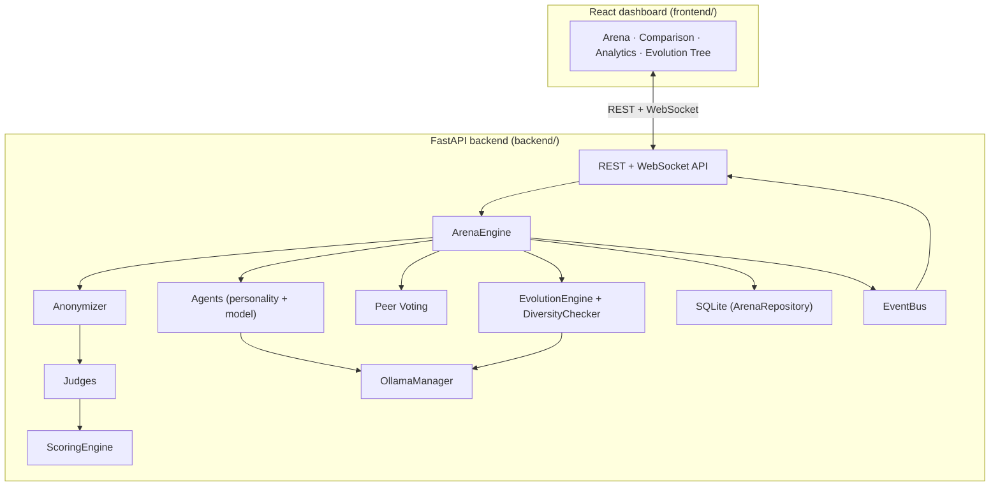

# EvoAgent

A multi-agent LLM competition and evolution system, built **from scratch**
on local Ollama models. Eight AI personalities answer the same question,
three independent judges score them **without knowing who wrote what**, a
weighted leaderboard ranks them, the weakest agent is eliminated — and an
Evolution Engine designs its replacement from exactly what made it lose.

The goal isn't just "run 8 prompts and pick the best one." It's to watch
selection pressure actually reshape a population of AI personalities over
many rounds, with the full lineage — every score, every critique, every
ancestor — preserved and queryable.



---

## Table of contents

- [How EvoAgent works](#how-evoagent-works)
  1. [Personalities vs. models](#1-personalities-vs-models)
  2. [The agent pipeline](#2-the-agent-pipeline)
  3. [Anonymous judging](#3-anonymous-judging)
  4. [Scoring](#4-scoring)
  5. [Peer voting (optional)](#5-peer-voting-optional)
  6. [Elimination](#6-elimination)
  7. [Evolution](#7-evolution)
  8. [Diversity checking](#8-diversity-checking)
  9. [Multi-round competition](#9-multi-round-competition)
  10. [Persistence](#10-persistence)
  11. [Real-time streaming](#11-real-time-streaming)
- [Project architecture](#project-architecture)
- [Running it locally](#running-it-locally)
- [Demo mode](#demo-mode)
- [Running the tests](#running-the-tests)
- [Configuration](#configuration)
- [API reference](#api-reference)
- [Limitations](#limitations)
- [Future improvements](#future-improvements)

---

## How EvoAgent works

### 1. Personalities vs. models

EvoAgent deliberately keeps **personality** and **model** as two separate
concepts, never merged: the personality (`app/personalities.py`) is a
system prompt plus declared specialties/weaknesses, and the model
(`app/model_assignment.py`) is the local Ollama weights that actually run
it. The personality shapes *how* an agent thinks; the model provides the
underlying capability.

| Personality | Preferred model family |
|---|---|
| Scientist, Professor | `qwen` |
| Engineer, Researcher | `llama` |
| Devil's Advocate, Creative | `mistral` |
| Minimalist, Strategist | `gemma` |

`app/agent.py` resolves each family to whatever's actually installed via
`OllamaManager.find_model_by_family()` — so the roster runs on whatever
models you've pulled, not a hardcoded tag.

### 2. The agent pipeline

Each of the 8 agents is the same abstraction (`app/agent.py`) wrapping a
different `(personality, model)` pair:

```
Question → Personality's system prompt → Ollama generate() → Answer
```

All 8 run **concurrently**, not sequentially — `arena_round.py` fires every
agent's `answer()` coroutine at once and awaits the batch, which is what
makes an 8-agent round take as long as the slowest single agent rather than
the sum of all eight.

### 3. Anonymous judging

The single most important integrity rule in EvoAgent: **judges never see
which personality or model produced an answer.** `app/anonymizer.py`
relabels every successful answer as `Answer A`, `Answer B`, ... `Answer H`
before it ever reaches a judge, and keeps the `{letter: agent_id}` mapping
privately — judges only receive the letters.

```
Scientist  → answer  ┐
Engineer   → answer  ├──►  Answer A, Answer B, Answer C, ... Answer H  ──► Judges
Creative   → answer  ┘
```

This is what stops a judge from scoring "Scientist" highly just because
it's labeled Scientist — reputation can't leak into the score.

### 4. Scoring

Three independent judges (`app/judges.py`) each evaluate **every** answer on
the same three dimensions — but each one is told to weigh one dimension
most heavily, so they genuinely disagree rather than being three copies of
the same evaluation:

| Judge | Weighs most heavily |
|---|---|
| Accuracy Judge | Factual and technical correctness |
| Reasoning Judge | Soundness and clarity of logic |
| Utility Judge | Practical, actionable value |

`app/scoring_engine.py` then combines all three judges' scores per answer
into one weighted final score:

```
final_score = 0.40 × accuracy + 0.35 × reasoning + 0.25 × utility
```

Weights are configurable, not hardcoded, and always validated to sum to
`1.0`. A judge occasionally returns an out-of-range score (a `0`, an `11`,
a stray string) — `_clamp_score_fields()` pulls it back into `1–10` rather
than letting one sloppy model response sink the whole round.

### 5. Peer voting (optional)

Behind a config flag, agents can also vote for the best answer among the
same anonymized set — with one rule: **an agent can never vote for
itself.** When enabled, the final score blends judge and peer signal:

```
final_score = judge_score × (1 − peer_vote_weight) + vote_score × peer_vote_weight
```

It ships **off by default** specifically so you can run the same
competition with and without it and see whether peer voting improves
ranking quality or just introduces bias.

### 6. Elimination

After scoring, the lowest-ranked agent for the round is eliminated — but
**never deleted**. Its personality, full performance history, every answer,
every judge critique, and the reason it was cut are all preserved in
SQLite. Rank 1 through 7 survive into the next round unchanged; rank 8 is
retired, not erased.

### 7. Evolution

This is the signature mechanic. `app/evolution_input.py` gathers everything
about the eliminated personality — its declared strengths/weaknesses,
average score, judge critiques, and which questions it handled well vs.
poorly — and hands it to the `EvolutionEngine` (`app/diversity.py`), which
asks an LLM to design its successor: something that **keeps what worked and
directly targets what didn't.**

```
Creative
  ✓ unconventional ideas
  ✗ poor factual accuracy
  ✗ poor technical feasibility
        │
        ▼
Creative Engineer
  ✓ creativity, unconventional thinking
  ✓ improved technical feasibility
  ✓ improved factual checking
```

Identity fields — `id`, `generation`, `parent_agent` — are always computed
in code from the parent, **never trusted from the LLM's JSON output**, the
same discipline as personality/model separation: the LLM designs behavior,
the system assigns identity.

### 8. Diversity checking

Left unchecked, repeated evolution converges on near-duplicates —
`Creative → Creative Engineer → Creative Engineer Pro → Creative Engineer 2`.
`DiversityChecker` (`app/diversity.py`) scores every newly evolved
personality against the surviving roster using token-overlap similarity
across name, description, system prompt, specialties, and weaknesses:

```
New personality
      │
      ▼
Compare against all 7 survivors
      │
 similarity ≥ 0.65?
   ┌───┴───┐
  YES      NO
   │        │
Regenerate Accept
 (up to 3 attempts)
```

If three attempts all come back too similar, evolution fails loudly rather
than silently accepting a near-clone.

### 9. Multi-round competition

`ArenaEngine` (`app/arena_engine.py`) orchestrates the whole loop —
generate answers, judge, score, eliminate, evolve — as one
`run_round(question)` call, and can be driven for any configured number of
rounds:

```
Round 1: 8 original personalities → weakest eliminated → 1 newborn
Round 2: 7 survivors + newborn     → weakest eliminated → 1 newborn
Round 3: ...
```

Across rounds, the roster gradually shifts from the 8 hand-authored
starting personalities toward ones shaped entirely by what actually scored
well against real questions.

### 10. Persistence

Every table below is written on every round, so the system survives a
restart and questions like *"what happened to the Scientist in Round 5?"*
are answerable straight from SQLite rather than only from a live
in-memory engine (`app/persistence.py` / `app/database.py`):

`agents` · `rounds` · `answers` · `evaluations` · `votes` · `eliminations` · `evolutions`

### 11. Real-time streaming

A WebSocket event bus (`app/events.py`) emits a fine-grained sequence of
events for every round, so a frontend can render the whole pipeline live
instead of waiting for a single final response:

```
ROUND_STARTED → AGENT_STARTED → AGENT_COMPLETED → ... 
             → JUDGING_STARTED → JUDGE_COMPLETED → SCORES_UPDATED 
             → AGENT_ELIMINATED → EVOLUTION_STARTED → NEW_AGENT_CREATED 
             → ROUND_COMPLETED
```

---

## Project architecture



```
EvoAgent/
├── backend/
│   ├── app/
│   │   ├── agent.py, agent_factory.py       # Agent abstraction + model assignment
│   │   ├── personalities.py                 # The 8 base personalities
│   │   ├── model_assignment.py               # Personality → model family mapping
│   │   ├── ollama_manager.py                 # Model discovery, generation, health checks
│   │   ├── arena_engine.py, arena_round.py    # Round orchestration
│   │   ├── anonymizer.py, judges.py           # Anonymous judging
│   │   ├── scoring_engine.py                  # Weighted leaderboard
│   │   ├── peer_voting.py                     # Optional peer-vote scoring
│   │   ├── diversity.py                       # Evolution engine + diversity checker
│   │   ├── evolution_input.py                 # Builds evolution prompts from agent history
│   │   ├── persistence.py, database.py        # SQLite storage
│   │   ├── events.py                          # WebSocket event bus
│   │   ├── models/                            # Pydantic schemas
│   │   └── routers/arena.py                   # HTTP + WebSocket API
│   ├── tests/                                  # Full pytest suite, one file per module
│   ├── demo_round.py                           # Runs one full round with mocked Ollama calls
│   └── phases.md                               # The 20-phase build roadmap
└── frontend/
    └── src/
        ├── pages/       # Arena, Comparison, Analytics, Evolution Tree
        ├── components/  # AgentCard, Leaderboard, AnswerCard, ScoreHistoryChart, etc.
        └── hooks/useArenaSocket.js  # WebSocket client for live round events
```

FastAPI stays a thin shell on purpose — every route in `routers/arena.py`
just calls into the engine layer and shapes the HTTP response around
whatever comes back; no arena logic lives in the API layer itself.

---

## Running it locally

### Prerequisites

- Python 3.12+
- Node.js
- [Ollama](https://ollama.com) running locally, with a few models pulled
  (e.g. `qwen`, `llama3`, `mistral`, `gemma`)

### Backend

```bash
cd backend
python3 -m venv venv
source venv/bin/activate          # Windows: venv\Scripts\activate
pip install -r requirements.txt
cp .env.example .env
```

Run it:

```bash
uvicorn app.main:app --reload
```

Check it's alive:

```bash
curl http://localhost:8000/api/health
```

### Frontend

```bash
cd frontend
npm install
cp .env.example .env.local
npm run dev
```

By default the frontend expects the API at `http://localhost:8000`
(`VITE_API_BASE`).

---

## Demo mode

No Ollama required — every call is mocked with `respx` through the **real**
`ArenaEngine`, `EvolutionEngine`, and `DiversityChecker`, so it's not a
fake shortcut, it's the actual pipeline with the network layer swapped out:

```bash
cd backend
python demo_round.py
```

This prints one complete round end to end — 8 answers, judging, scoring,
elimination, and evolution — instantly, which is the fastest way to see
the whole system work without waiting on real model inference.

---

## Running the tests

```bash
cd backend
python3 -m pytest tests/ -v
```

One test file per module — agent, personalities, ollama_manager,
anonymizer, judges, scoring_engine, peer_voting, diversity, evolution,
evolution_input, arena_engine (+ events), multi-round evolution,
persistence, and the API/WebSocket layer.

---

## Configuration

Key environment variables (see `backend/.env.example` for the full list
with inline explanations):

| Variable | Purpose |
|---|---|
| `OLLAMA_HOST` | Where Ollama is running |
| `OLLAMA_NUM_CTX` / `OLLAMA_NUM_PREDICT` | Context/generation limits — matter a lot for judge calls, which read all 8 answers in one prompt |
| `DATABASE_PATH` | SQLite file location |
| `PEER_VOTING_ENABLED` / `PEER_VOTE_WEIGHT` | Toggle and weight the peer-voting mechanic |
| `DEV_MODEL_OVERRIDE` / `DEV_JUDGE_MODEL_OVERRIDE` / `DEV_AGENT_LIMIT` | Dev-only shortcuts for fast local iteration on limited hardware |

---

## API reference

| Endpoint | Description |
|---|---|
| `GET /api/health` | App, DB, and Ollama status |
| `POST /api/arena/question` | Submit a question and run a round |
| `GET /api/arena/current` | Current arena state |
| `GET /api/agents` / `GET /api/agents/{id}` | Agent roster / single agent detail |
| `GET /api/rounds` / `GET /api/rounds/{round_number}` | Round history / single round |
| `GET /api/leaderboard` | Latest leaderboard |
| `GET /api/evolution` | Full evolutionary lineage |
| `WS /api/ws/arena` | Live round event stream |

---

## Limitations

- **Local models only.** Runs entirely on whatever's installed in Ollama —
  no hosted-API fallback.
- **Lightweight diversity check.** Token-overlap similarity is cheap and
  fast, not a semantic embedding comparison — it can miss deeper
  conceptual duplication.
- **Single-machine SQLite.** No multi-instance or networked-database
  story.
- **No authentication.** The API and dashboard assume a trusted local/dev
  environment.

## Future improvements

- Embedding-based diversity checking instead of token overlap
- Configurable judge count/focus beyond the fixed Accuracy/Reasoning/Utility trio
- Tournament/bracket modes beyond single-elimination-per-round
- Exportable evolutionary lineage (e.g. as a shareable report)
- Pluggable model backends beyond Ollama